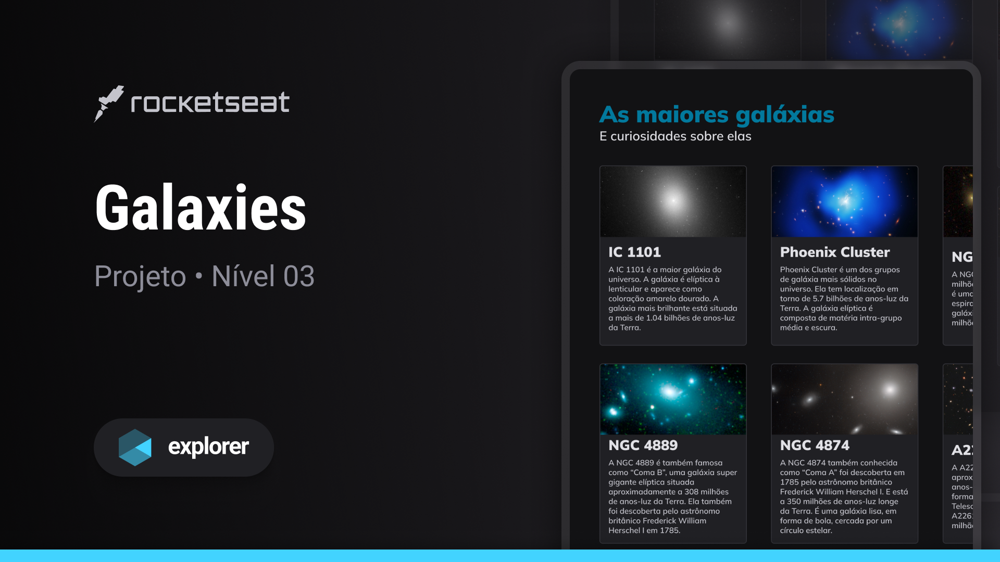

  

## 💻 Projeto
Esse projeto foi desenvolvido durante as aulas do Stage 03 no Explorer da [Rocketseat](https://rocketseat.com.br).

## 🚀 Tecnologias

Esse projeto foi desenvolvido com as seguintes tecnologias:

- HTML
- CSS

## 🔖 Layout

You can see the project layout through
[here](https://www.figma.com/community/file/1256354736253234634).
You must have an account at [Figma](https://www.figma.com)